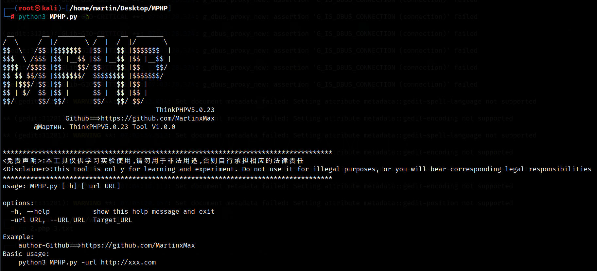

  <div align="center">
 
 <p align="center">
 
 
 
  
 
 
 </p>
  
  
   
 <table>
  <tr>
      <th>Function</th>
  </tr>
  <tr>
    <th>Verification vulnerability</th>
  </tr>
  <tr>
    <th>Get Webshell</th>
  </tr>
 </table>
</div>

## usage method
  * View help information

      ```#python3 MPHP.py -h```

    

# Vulnerability exploitation


    


 ```#python3 MPHP.py -url http://192.168.101.1:8080/```

    
  
_Connect Web Shell_

    
  
